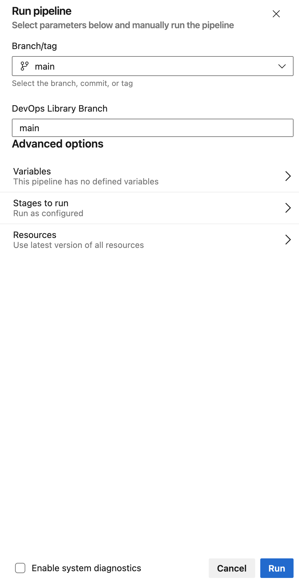
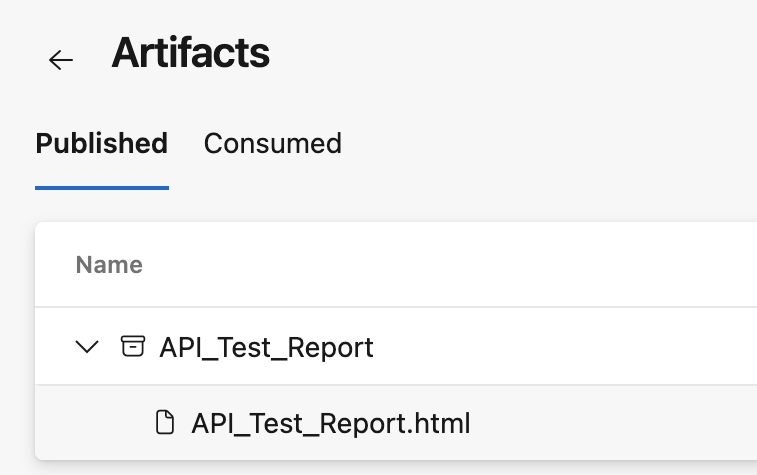

# Introduction
This is the repository that will contain the Automated API Tests for the HRA IRAS project

The Tests are written in JavaScript as part of a Postman Collection using the Postman Sandbox environment.

The most recent version of the Postman Collection is exported as a JSON file from our teams Postman workspace and added to this repository.

This is to:
- Back-up the test scripts and store them in a controlled, secure, and managed platform.
- Allows us to run the Collection as part of a CI/CD Azure DevOps pipeline.

The Tests can be run locally on the Dev Box via the Postman Collection runner  
&nbsp;  

# Pre-requisites
Follow the setup guide [here](https://healthresearchauthority.sharepoint.com/:w:/r/sites/Future-IRAS/Testing/QA%20Setup%20Docs/HRA%20Postman%20Setup%20Document.docx?d=wf8cb2dd417a74a618d57f47774fa7701&csf=1&web=1&e=f4wr1f) to set up Postman on your Dev Box and connect with the team workspace.
Also review the document along with the [Tooling Standards Document]() (UPDATE THIS) to understand the best practices for using Postman and running tests  
&nbsp;  

# Running in Postman
Follow the setup guide [here](https://healthresearchauthority.sharepoint.com/:w:/r/sites/Future-IRAS/Testing/QA%20Setup%20Docs/HRA%20Postman%20Setup%20Document.docx?d=wf8cb2dd417a74a618d57f47774fa7701&csf=1&web=1&e=f4wr1f) for information on running the tests on the Postman Desktop application on your Dev Box.
This includes running the tests on an individual basis and running the entire Collection.  
&nbsp;  

# Running in the Azure DevOps Pipeline
To run the API test scripts in the Azure pipeline:
- Go to the repo’s pipeline job [here](https://dev.azure.com/FutureIRAS/Research%20Systems%20Programme/_build?definitionId=15) 
- Click the Run pipeline button

  

- Select the desired repository branch, main by default
- Select the desired DevOps Library branch, main by default
- Click the Run button

  

The test run will produce an HTML Test Report as a Pipeline artifact, this artifact is available to download and view. 

  

This artifact will also be published to the teams SharePoint space [here](https://healthresearchauthority.sharepoint.com/:f:/r/sites/Future-IRAS/Testing/Test%20Reports?csf=1&web=1&e=8jF7Ic)  
&nbsp;  

# Supporting Documentation
1. [Test Tooling Standards Document](https://healthresearchauthority.sharepoint.com/:w:/r/sites/Future-IRAS/Testing/RSP%20Test%20Approach/Draft/Automation%20Test%20Tool%20Standards%20Draft%20Content.docx?d=wc9b5951cd936470984f391877ed0bd20&csf=1&web=1&e=PRwea3) (UPDATE THIS)
2. [HRA Postman Setup Guide](https://healthresearchauthority.sharepoint.com/:w:/r/sites/Future-IRAS/Testing/QA%20Setup%20Docs/HRA%20Postman%20Setup%20Document.docx?d=wf8cb2dd417a74a618d57f47774fa7701&csf=1&web=1&e=f4wr1f)
3. [Postman Documentation](https://learning.postman.com/docs/introduction/overview/)